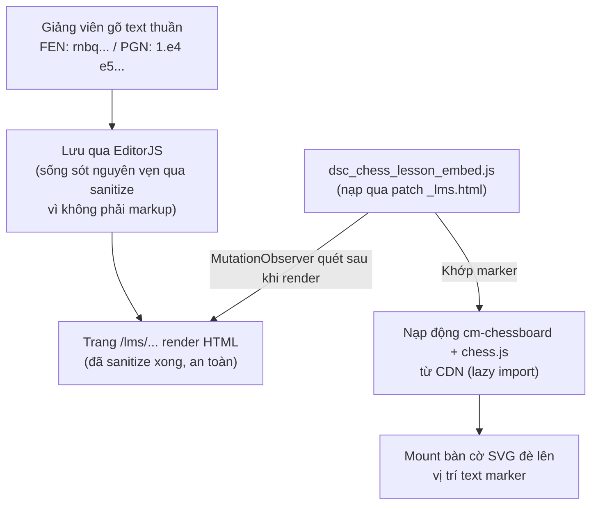
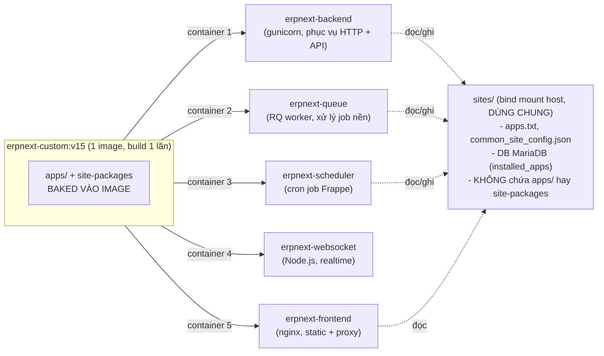

# TECH.md — Kiến trúc kỹ thuật & thuật toán chi tiết

> Đọc `AGENTS.md` trước nếu chưa đọc. File này đi sâu vào CÁCH tính năng hoạt động và
> TẠI SAO thiết kế như vậy, để bất kỳ ai (người hoặc AI) sửa code sau này không vô tình
> phá vỡ những ràng buộc đã được xác minh kỹ.

## 1. Bài toán gốc và vì sao các hướng "hiển nhiên" đều không dùng được

Frappe LMS (`frappe/lms`, nhánh `version-15`) lưu nội dung Course Lesson dưới dạng
**EditorJS JSON** (field `content`/`instructor_content`, kiểu `Text` với
`ignore_xss_filter: 1`), không phải Markdown/HTML thô.

Đã xác minh trực tiếp trên mã nguồn thật (qua GitHub API, không phải suy đoán):

| Lớp phòng thủ | Vị trí | Hành vi |
|---|---|---|
| Editor (Vue, `BlockEditor.vue`) | `frontend/src/components/BlockEditor.vue` | Chỉ có tool `paragraph` (qua `markdown-it`), `embed` (allowlist regex cố định: YouTube/Vimeo/Cloudflare Stream/Bunny/Aparat/Google Docs-Sheets-Slides/CodeSandbox), `simple-image`, `table`. Không có block HTML thô, không có plugin API cho app ngoài. |
| Client render (`LessonContent.vue`) | `frontend/src/directives/safeHtml.ts` | Directive `v-safe-html:rich` dùng DOMPurify với hook `uponSanitizeElement` **loại bỏ mọi `<iframe>`** ở mọi profile, thay bằng `<a href>`. |
| Server (`Course Lesson.validate()`) | `lms/lms/utils.py` → `sanitize_editorjs()` | Duyệt toàn bộ JSON, loại `<iframe>`/`<script>` khỏi mọi string trước khi lưu DB. |

→ **Không có cách nào để một AI/giảng viên nhúng iframe, HTML thô, hay gọi script tùy
ý qua chính trình soạn thảo.** Đây là kết luận đã kiểm chứng, không phải giả định — nếu
sau này có ý định "chỉ cần thêm 1 block HTML là xong", hãy đọc lại bảng trên trước.

## 2. Giải pháp: xử lý ở tầng DOM đã render, đứng ngoài hoàn toàn pipeline trên



Nguyên lý: KHÔNG cố vượt qua pipeline sanitize (bất khả thi, xem mục 1). Thay vào đó,
một script hoàn toàn tách biệt chạy SAU khi trang đã render xong, đọc lại DOM (lúc này
nội dung đã an toàn, đã qua sanitize), tìm text thuần dạng marker, và tự mount widget
bằng JavaScript thuần — không đụng gì đến dữ liệu lưu trữ hay pipeline render gốc.

## 3. `dsc_chess_lesson_embed.js` — thuật toán chi tiết

File duy nhất chứa toàn bộ logic: `dsc_chess/public/js/dsc_chess_lesson_embed.js`.

### 3.1. Vòng quét (scan loop)

```
MutationObserver(document.body, {childList: true, subtree: true})
  → debounce 400ms → scan()

scan():
  for el in document.body.querySelectorAll("p, div"):
    if el.children.length > 0: skip        # chỉ xét node lá
    if el trong mounted (WeakSet): skip
    if el.closest("[data-dsc-chess]"): skip # tránh quét lại widget đã mount
    raw = el.textContent                    # KHÔNG dùng innerText (xem mục 3.3)
    if len(raw) ngoài [5, 4000]: skip
    if không chứa "FEN:"/"fen:"/"PGN:"/"pgn:": skip   # lọc rẻ trước khi regex
    text = raw.trim()
    match RE_FEN = /^FEN:\s*(.+)$/i  hoặc  RE_PGN = /^PGN:\s*([\s\S]+)$/i
    → nếu khớp: mountBoard(el, fen) hoặc mountPgnViewer(el, pgn)
```

Quyết định thiết kế:
- **Quét theo nội dung text, không theo class CSS của LMS.** LMS có thể đổi cấu trúc
  DOM/class name ở bất kỳ bản nâng cấp nào (đây là app của Frappe, không phải của DSC).
  Quét theo `p, div` + nội dung text là cách duy nhất không phụ thuộc vào chi tiết nội
  bộ dễ đổi của `lms`. Trade-off: nếu LMS đổi hẳn sang Shadow DOM, cách này sẽ ngừng
  hoạt động một cách "graceful" (không crash, chỉ không hiện board) — chấp nhận được.
- **`WeakSet` để tránh mount lại.** Khi Vue re-render (điều hướng qua lại giữa các bài
  học trong SPA), node cũ bị GC, `WeakSet` tự "quên", node mới bị coi là chưa mount →
  đúng hành vi mong muốn (mount lại cho lần hiển thị mới).
- **`el.closest("[data-dsc-chess]")`** để không quét vào bên trong chính widget đã
  mount (widget có thể chứa text như nhãn "Bắt đầu"/số nước đi).

### 3.2. Cú pháp marker — lý do thiết kế

```
FEN: rnbqkbnr/pppppppp/8/8/8/8/PPPPPPPP/RNBQKBNR w KQkq - 0 1
PGN: 1. e4 e5 2. Nf3 Nc6 3. Bb5 a6 4. Ba4 Nf6 5. O-O Be7 1-0
```

Nguyên tắc: **1 block EditorJS (1 đoạn văn riêng) = 1 marker**, PGN bắt buộc **1 dòng,
chỉ movetext, không có header tags** (`[Event "..."]` v.v.).

Lý do KHÔNG dùng PGN đa dòng/đầy đủ header ngay từ đầu:
1. `markdown-it` (chạy trong block `paragraph` của EditorJS) sẽ diễn giải một dòng bắt
   đầu bằng số + dấu chấm (`1. e4 e5`) đặt ở ĐẦU DÒNG RIÊNG thành danh sách có thứ tự
   (`<ol><li>`), phá vỡ cấu trúc text trước khi script kịp đọc. Ép PGN vào 1 dòng liền
   né hoàn toàn vấn đề này.
2. Hành vi của EditorJS `paragraph` khi paste nhiều dòng (tách block hay giữ `<br>`
   trong cùng block) **chưa được kiểm chứng thực tế** tại thời điểm viết — không đặt
   cược vào hành vi chưa rõ.
3. `chess.js.loadPgn()` (dùng ở mục 3.4) chấp nhận PGN chỉ-movetext, không bắt buộc
   header — nên không mất chức năng gì khi bỏ header.

Nếu sau này cần hỗ trợ PGN đa dòng đầy đủ: **bắt buộc làm 1 spike nhỏ kiểm chứng hành
vi soft-break của EditorJS `paragraph` trước**, đừng giả định.

### 3.3. Vì sao `textContent`, không phải `innerText`

`el.innerText` buộc trình duyệt **tính lại layout đồng bộ (forced synchronous reflow)**
để trả về text đã áp dụng CSS (ẩn/hiện, `white-space`...). `el.textContent` chỉ đọc
DOM tree, không đụng tới layout — rẻ hơn nhiều bậc.

Sự cố thực tế: bản đầu tiên dùng `innerText`, quét toàn `document.body` mỗi khi có
mutation. Trang soạn bài (EditorJS) đổi DOM liên tục theo từng thao tác gõ phím →
hàng loạt reflow đồng bộ dồn dập → **treo hẳn tab trình duyệt** khi gõ nội dung bình
thường. Đã sửa bằng `textContent` + thu hẹp query còn `p, div` (bỏ `span`) + bước lọc
`indexOf` rẻ trước khi chạy regex + debounce 400ms. Xem `MEMORY.md` sự cố #3 để biết
chi tiết quá trình phát hiện/khắc phục.

### 3.4. Nạp thư viện động (lazy CDN import)

```js
loadLibs() {
  return Promise.all([
    import("https://cdn.jsdelivr.net/npm/cm-chessboard@8.15.1/src/Chessboard.js"),
    import("https://cdn.jsdelivr.net/npm/chess.js@1.4.0/dist/esm/chess.js"),
  ])
}
```

- Chỉ gọi **khi thực sự tìm thấy marker** trên trang (không tải phí băng thông trên
  trang không có nội dung cờ vua).
- Dùng `import()` động (native ES dynamic import) — hoạt động trong classic `<script>`
  bình thường, không cần `type="module"`.
- **Không vendor 2 thư viện này vào repo** — quyết định có chủ đích, đánh đổi lấy đơn
  giản (`cm-chessboard` không có bản UMD/minified single-file chính thức, chỉ ship
  dạng ES module đa file với nhiều import tương đối — vendor đúng cách sẽ phải copy cả
  cây `src/` + `assets/`). Rủi ro: phụ thuộc CDN jsDelivr còn sống. Nếu cần bỏ phụ
  thuộc CDN sau này, xem `MEMORY.md` phần "quyết định chưa hoàn tất" để biết đã cân
  nhắc gì.
- **Thư viện đã chọn và lý do:** `cm-chessboard` (MIT, vẽ bàn cờ SVG) + `chess.js`
  (BSD-2-Clause, parse PGN/sinh FEN từng nước). Chủ động loại `chessground`/
  `@mliebelt/pgn-viewer` vì cả hai đều **GPL-3.0**.

### 3.5. Render FEN tĩnh (`mountBoard`)

```
1. Ẩn node marker gốc (display:none) — KHÔNG xoá khỏi DOM, để Vue vẫn "sở hữu" nó,
   tránh xung đột virtual DOM khi Vue diff lại.
2. Tạo <div data-dsc-chess="board"> làm sibling ngay sau node gốc.
3. loadLibs() rồi new Chessboard(box, {position: fen, assetsUrl: CDN_ASSETS_URL})
4. try/catch quanh toàn bộ — lỗi chỉ hiện dòng cảnh báo nhỏ tại chỗ, không throw ra
   ngoài làm vỡ trang Vue.
```

### 3.6. Render PGN động (`mountPgnViewer`)

```
1. new Chess() → chess.loadPgn(pgnText, {strict: false})
2. history = chess.history({verbose: true})   # mảng các nước đi, mỗi phần tử có .after (FEN sau nước đó) và .san
3. fens = [FEN_khởi_đầu, ...history.map(h => h.after)]
4. idx = 0; mount Chessboard(fens[0])
5. 4 nút |< < > >| điều khiển idx, gọi board.setPosition(fens[idx], true) + cập nhật
   nhãn "idx / tổng (SAN nước vừa đi)"
6. Nút Prev/First tự disable khi idx=0, Next/Last tự disable khi idx=cuối.
```

Đã xác minh đúng bằng cách zoom pixel-level vào từng vị trí quân sau khi bấm Next
nhiều lần trên 1 ván Ruy Lopez 16-ply thật — khớp chính xác từng nước (xem
`MEMORY.md`).

**Ràng buộc quan trọng:** không gắn listener bàn phím toàn cục
(`document.addEventListener('keydown', ...)`) cho các nút điều khiển — chỉ gắn
`onclick` trực tiếp lên nút nằm trong subtree của widget, để khi Vue gỡ bỏ cả cụm nội
dung (rời bài học), trình duyệt tự dọn dẹp cùng lúc, không rò rỉ bộ nhớ qua nhiều lần
chuyển bài.

## 4. Cơ chế nạp script vào trang LMS — patch `_lms.html`

**Phát hiện quan trọng nhất của toàn bộ dự án, khác với giả định ban đầu trong kế
hoạch:** cơ chế chuẩn `web_include_js` của Frappe Framework (khai báo trong
`hooks.py`, tự động chèn `<script>` vào mọi trang website qua boilerplate
`templates/web.html`) **KHÔNG có tác dụng trên các trang `/lms/*`**.

Nguyên nhân: route `/lms/*` được phục vụ bởi `apps/lms/lms/www/_lms.py` (`get_context`)
+ template `apps/lms/lms/www/_lms.html` — một file HTML hoàn chỉnh
(`<!DOCTYPE html>...</html>`) tự sinh ra bởi Vite khi `yarn build` chạy trong
`apps/lms/frontend`, KHÔNG `` base template chuẩn của Frappe. Vì vậy hook
`web_include_js` (vốn chỉ chèn vào boilerplate chuẩn) không bao giờ chạm tới trang này.

**Giải pháp đang dùng (Phương án B, đã xác minh hoạt động):** patch trực tiếp file
`_lms.html` tại **build-time**, ngay sau bước `yarn build` của `lms` trong Dockerfile,
chèn `<script>`/`<link>` trước `</body>`:

```dockerfile
sed -i 's#</body>#<script src="/assets/dsc_chess/js/dsc_chess_lesson_embed.js"></script><link rel="stylesheet" href="/assets/dsc_chess/css/dsc_chess_lesson_embed.css"></body>#' "$LMS_TEMPLATE"
```

Đây **không phải sửa git source của `lms`** — `_lms.html` là sản phẩm build (bị
`.gitignore` bởi chính repo `lms`, không phải file người dùng chỉnh sửa), nên patch nó
sau khi build không vi phạm nguyên tắc "không sửa source lms". Patch này áp dụng lại tự
động mỗi lần Dockerfile chạy `git clone` + `yarn build` mới cho `lms`.

**Rủi ro đã biết:** nếu bản LMS sau này đổi cấu trúc `_lms.html` (ví dụ Vite đổi cách
sinh template, hoặc route `/lms/*` chuyển sang cơ chế khác hẳn), lệnh `sed` có thể không
khớp được `</body>` mong muốn, hoặc khớp sai chỗ. Dockerfile đã có `test -f` +
`grep -q dsc_chess` SAU sed để build **fail rõ ràng ngay lập tức** nếu patch không áp
dụng được — không để mất tính năng âm thầm trên production. Nếu build fail ở bước này
trong tương lai: đọc lại `_lms.html` mới xem cấu trúc đã đổi thế nào, không tự động
retry/bỏ qua.

## 5. Cách render được xác nhận qua route nào

Đã kiểm chứng qua `curl` + đọc source: `/lms` route → nginx `location /` →
`try_files ... @webserver` (không khớp static) → proxy sang backend Python → Frappe
route resolver gọi `lms.www._lms.get_context()` + render `_lms.html`. File
`apps/lms/lms/public/frontend/index.html` (bản copy trong thư mục `public/`) **KHÔNG
phải file thực sự được serve cho route `/lms`** — chỉ là artifact build còn sót lại,
đừng patch nhầm file này (đã từng patch nhầm 1 lần trong lúc debug, xem `MEMORY.md`).

## 6. Kiến trúc triển khai multi-container — vì sao phức tạp hơn 1 app Frappe thông thường



**Điểm mấu chốt:** `apps/` (mã nguồn) và Python site-packages **nằm trong từng
container riêng** (baked vào image ở build-time, hoặc container's writable layer nếu
thêm live qua `docker exec`). `sites/` (config, `apps.txt`, DB connection) **dùng chung
qua volume**. Khi thêm 1 app mới bằng `docker exec` (không rebuild image):
- `bench install-app` ghi vào DB (dùng chung) → **mọi container ngay lập tức "biết"**
  app đã cài cho site này.
- Nhưng chỉ container VỪA chạy `pip install -e` mới thực sự IMPORT được package đó.
- → Container khác cố resolve site (mọi request/job) sẽ gặp
  `ModuleNotFoundError` ngay lập tức → **crash toàn bộ**, kể cả các route không liên
  quan gì tới app mới.

Quy trình đúng khi thêm app mới qua `docker exec` (không rebuild image, dùng để test
nhanh trước khi persist vào Dockerfile):
1. `git clone` + `pip install -e` vào **TẤT CẢ** container chạy Python
   (`erpnext-backend`, `erpnext-queue`, `erpnext-scheduler` — `erpnext-websocket` chạy
   Node.js nên không cần).
2. Tạo symlink asset (`ln -sf .../public assets/<app>`) ở **TẤT CẢ** container phục vụ
   web (`erpnext-backend` cho patch `_lms.html`, `erpnext-frontend` cho static file
   thực tế qua nginx).
3. CHỈ SAU KHI mục 1+2 xong ở mọi nơi cần thiết, mới chạy `bench install-app` (đổi
   trạng thái DB dùng chung).
4. Restart các container đã thay đổi Python package (`docker restart`) để process mới
   nạp lại `sys.path`.

Nếu container rơi vào crash-loop (do lỡ làm sai thứ tự trên): dùng `docker cp` copy
trực tiếp `apps/<app>` + artifact `pip install -e` (`<app>.pth`,
`<app>-*.dist-info`) từ container ĐÃ cài đúng sang container đang lỗi — `docker cp`
hoạt động được cả khi container đang restart/crash-loop, khác với `docker exec` (yêu
cầu container ở trạng thái running ổn định).

## 7. Tích hợp Dockerfile production

File: `/etc/dokploy/compose/erpnext-prod/code/Dockerfile` trên VPS (không nằm trong
repo Git nào — chỉnh sửa trực tiếp qua SSH, luôn `cp Dockerfile Dockerfile.bak-<ts>`
trước khi sửa).

Pattern nhất quán với các app khác đã có (`education`, `crm`, `payments`, `lms`): mỗi
app 1 `RUN` block độc lập, `git clone --depth 1` + `pip install -e` + symlink asset.
Block của `dsc_chess` thêm sau block `lms` (vì cần `apps/lms/lms/www/_lms.html` đã tồn
tại để patch — xem mục 4).

`apps.txt` (`/etc/dokploy/compose/erpnext-prod/data/sites/apps.txt`) nằm trên volume
dữ liệu, **không bị mất khi rebuild image** — chỉ cần thêm 1 lần.

## 8. Trang công cụ `chess-fen-builder.html` — kiến trúc khác hẳn mục 3-4

File: `dsc_chess/www/chess-fen-builder.html`. Đây là 1 route Frappe **hoàn toàn bình
thường** (`www/*.html` tự route theo tên file), khác biệt rõ ràng với cơ chế nhúng đã
mô tả ở mục 2-4 — đừng nhầm lẫn 2 cơ chế:

| | `dsc_chess_lesson_embed.js` (mục 2-4) | `chess-fen-builder.html` (mục này) |
|---|---|---|
| Route | Mọi trang `/lms/*` (SPA của app khác) | 1 route riêng `/chess-fen-builder` (của chính `dsc_chess`) |
| Cách nạp | Patch `_lms.html` tại build-time (vì `web_include_js` không chạm tới SPA) | Không cần patch gì — Frappe tự phục vụ `www/*.html`, không cần sửa `hooks.py` |
| Nạp thư viện | `import()` động, lazy, chỉ khi tìm thấy marker | `<script type="module">` tĩnh, nạp ngay khi vào trang |
| Cần `bench build`? | Không (asset tĩnh qua symlink) | Không (file `.html` đọc trực tiếp, không phải asset qua `web_include_js`) |
| Container cần đồng bộ khi deploy | `erpnext-backend` (đọc/patch `_lms.html`) + `erpnext-frontend` (serve JS/CSS tĩnh) | **Chỉ `erpnext-backend`** — đã xác nhận bằng `curl` (route không khớp static path, luôn proxy qua Python) |

### 8.1. Vì sao không dùng `enableMoveInput`/`validateMoveInput` của cm-chessboard

Hệ thống move-input của `cm-chessboard` chỉ dùng để validate việc DI CHUYỂN 1 quân đã
có trên bàn — không hỗ trợ chọn loại quân MỚI để đặt vào ô trống (không có "chế độ board
editor" dựng sẵn, đã xác nhận qua đọc trực tiếp mã nguồn `Chessboard.js`/
`VisualMoveInput.js`, không có `MOVE_INPUT_MODE` cho phép đặt quân tự do).

**Cách làm đúng:** dùng trực tiếp API thao tác vị trí (`setPiece`, `getPiece`,
`getPosition`, `setPosition`), bắt sự kiện click bằng event delegation trên container
bàn cờ:

```js
boardContainerEl.addEventListener("click", (event) => {
  const squareEl = event.target.closest("[data-square]");
  if (!squareEl) return;
  const square = squareEl.getAttribute("data-square");
  board.setPiece(square, selectedPiece /* null = xoá */, false);
});
```

Đã xác nhận qua đếm số phần tử: bàn cờ vị trí khởi đầu có đúng **96** phần tử
`[data-square]` (= 64 ô + 32 quân, mỗi quân cũng tự mang `data-square` riêng nên
`closest()` luôn trả đúng ô dù click trúng ô trống hay trúng quân đang đứng trên đó).

### 8.2. Chuẩn hoá PGN thành 1 dòng — tái dùng nguyên tắc ở mục 3.2

Cùng lý do đã giải thích ở mục 3.2 (marker phải là text thuần, PGN phải 1 dòng để né
`markdown-it` hiểu nhầm số thứ tự nước đi thành danh sách) — trang này tự động hoá việc
đó thay vì bắt giảng viên tự làm tay:

```js
const chess = new Chess();
chess.loadPgn(rawText, { strict: false });        // chấp nhận PGN nhiều dòng, có header
const sanMoves = chess.history();                  // KHÔNG {verbose:true} — mảng SAN thuần
const movetext = sanMoves
  .map((san, i) => (i % 2 === 0 ? `${i / 2 + 1}. ${san}` : san))
  .join(" ");
// chess.pgn() LUÔN kèm header, KHÔNG dùng được để lấy movetext trần — phải tự ghép
// từ history() như trên.
let result = chess.getHeaders().Result;             // hoặc fallback regex trên rawText
```

**Đã xác nhận qua test thực tế (không phải lý thuyết):** `getHeaders().Result` trả
đúng giá trị `"1-0"` ngay cả khi PGN gốc HOÀN TOÀN không có header tag nào khác (chỉ có
`1-0` ở cuối movetext) — edge-case từng lo ngại lúc lập kế hoạch không xảy ra trên thực
tế với `chess.js` 1.4.0. Chi tiết 3 case đã test: xem
`docs/plans/chess_fen_builder_tool_completion_report.md` (repo `erpnext`) mục 2.2.

### 8.3. `navigator.clipboard.writeText()` có thể treo vô thời hạn — luôn đua với timeout

Phát hiện quan trọng khi test thực tế: hàm này có thể **không bao giờ resolve lẫn
không reject**, dù `navigator.permissions.query({name:'clipboard-write'})` báo
`"granted"` (quan sát được trong môi trường trình duyệt tự động hoá, khả năng liên
quan tới việc tab không có focus thật — spec Clipboard API yêu cầu document có focus).
`try/catch` một mình KHÔNG bắt được trường hợp này vì promise không bao giờ settle.

**Bắt buộc đua với `Promise.race` + timeout** để đảm bảo người dùng luôn thấy phản hồi
(toast thành công hoặc fallback textarea để tự Ctrl+C), không bao giờ im lặng:

```js
const outcome = await Promise.race([
  navigator.clipboard.writeText(text).then(() => "ok"),
  new Promise((resolve) => setTimeout(() => resolve("timeout"), 1500)),
]);
if (outcome === "ok") showToast("Đã sao chép vào clipboard");
else showCopyFallback(text, containerEl);   // textarea readonly đã select() sẵn
```

Nguyên tắc này áp dụng cho MỌI lần dùng Clipboard API trong các trang/tính năng khác
của `dsc_chess` sau này — không chỉ riêng trang này.
